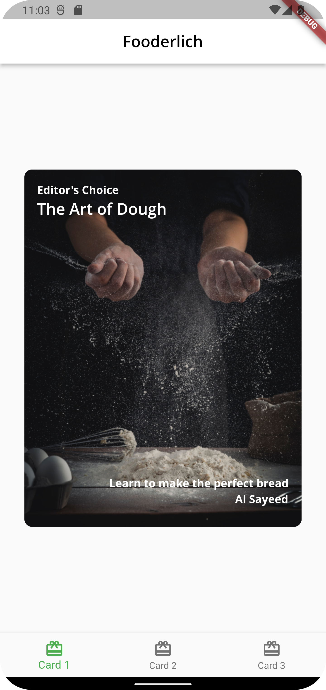
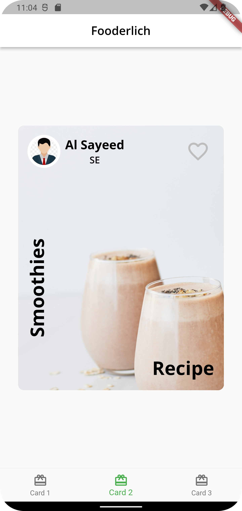
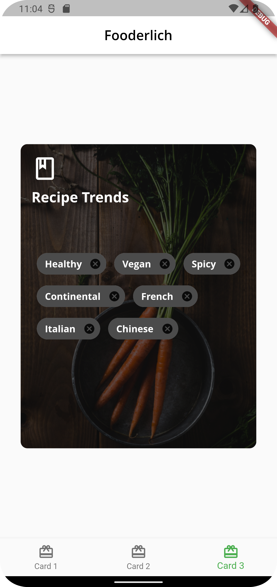

# Fooderlich

### Unleash your spicy imagination!

## Showcase

<table>
  <tr>
    <td>Recipe</td>
    <td>Author</td>
    <td>Explore</td>
  </tr>
  <tr>
    <td></td>
    <td></td>
    <td></td>
  </tr>
 </table>
<br/>

## Stacks

- Dart
- Flutter


## Keypoints
- Three main categories of widgets are: structure and navigation; displaying
information; and, positioning widgets
- Two main visual design systems available in Flutter, Material and
Cupertino
- Using the Material theme, WE can build quite varied user interface elements to
give your app a custom look and feel
- It’s generally a good idea to establish a common theme object for the app, giving
you a single source of truth for app’s style
- The Scaffold widget implements all basic visual layout structure needs
- The Container widget can be used to group other widgets together
- The Container widget can be used to group other widgets together


## Widgets

- [AppBar](https://api.flutter.dev/flutter/material/AppBar-class.html)
- [AssetImage](https://api.flutter.dev/flutter/painting/AssetImage-class.html)
- [BottomNavigationBar](https://api.flutter.dev/flutter/material/BottomNavigationBar-class.html)
- [BottomNavigationBarItem](https://api.flutter.dev/flutter/widgets/BottomNavigationBarItem-class.html)
- [BoxDecoration](https://api.flutter.dev/flutter/painting/BoxDecoration-class.html)
- [Center](https://api.flutter.dev/flutter/widgets/Center-class.html)
- [CircleAvatar](https://api.flutter.dev/flutter/material/CircleAvatar-class.html)
- [Chip](https://api.flutter.dev/flutter/material/Chip-class.html)
- [Column](https://api.flutter.dev/flutter/widgets/Column-class.html)
- [DecorationImage](https://api.flutter.dev/flutter/painting/DecorationImage-class.html)
- [Expanded](https://api.flutter.dev/flutter/widgets/Expanded-class.html)
- [Icon](https://api.flutter.dev/flutter/widgets/Icon-class.html)
- [IconButton](https://api.flutter.dev/flutter/material/IconButton-class.html)
- [Image](https://api.flutter.dev/flutter/widgets/Image-class.html)
- [MaterialApp](https://api.flutter.dev/flutter/material/Material-class.html)
- [Padding](https://api.flutter.dev/flutter/widgets/Padding-class.html)
- [Positioned](https://api.flutter.dev/flutter/widgets/Positioned-class.html)
- [RotatedBox](https://api.flutter.dev/flutter/widgets/RotatedBox-class.html)
- [Row](https://api.flutter.dev/flutter/widgets/Row-class.html)
- [Scaffold](https://api.flutter.dev/flutter/material/Scaffold-class.html)
- [SizedBox](https://api.flutter.dev/flutter/widgets/SizedBox-class.html)
- [SnackBar](https://api.flutter.dev/flutter/material/SnackBar-class.html)
- [Stack](https://api.flutter.dev/flutter/widgets/Stack-class.html)
- [Text](https://api.flutter.dev/flutter/widgets/Text-class.html)
- [TextTheme](https://api.flutter.dev/flutter/material/TextTheme-class.html)
- [ThemeData](https://api.flutter.dev/flutter/material/ThemeData-class.html)
- [Wrap](https://api.flutter.dev/flutter/widgets/Wrap-class.html)
<br/>

## Q&A

```

```

## Docs and References
- [Material design system](https://material.io)
- [Material UI Components](https://flutter.dev/docs/development/ui/widgets/material)
- [Cupertino UI Components](https://flutter.dev/docs/development/ui/widgets/cupertino)
- [Material Components
widgets](https://flutter.dev/docs/development/ui/widgets/material)
- [Layout widgets](https://flutter.dev/docs/development/ui/widgets/layout)
- [Chip widget](https://medium.com/aubergine-solutions/1c46217dca9b)
- [Widget UI component library](https://gallery.flutter.dev/)

