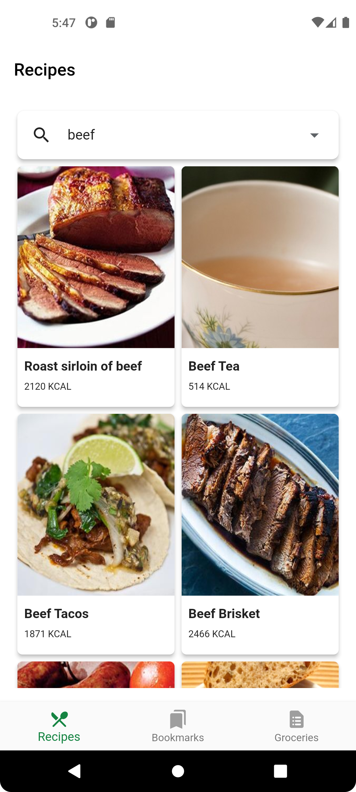
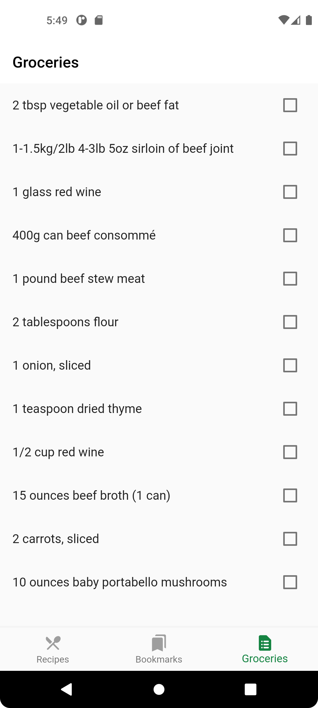

# Fooderlich

### Unleash your spicy imagination!

## Showcase

<table>
  <tr>
    <td>Recipe from api</td>
    <td>Bookmarked recipes</td>
    <td>Ingredients list</td>
  </tr>
  <tr>
    <td></td>
    <td></td>
    <td></td>
  </tr>
 </table>
<br/>

## Stacks

- Dart
- Flutter


## Keypoints
### Chapter 14 - Streams
- Streams are a way to asynchronously send data to other parts of the app.
- We usually create streams by using StreamController.
- Use StreamBuilder to add a stream to our UI.
- Abstract classes, or interfaces, are a great way to abstract functionality.

## Q&A

```

```
# Docs and References
### Chapter 14 - Streams
- [Streams](https://dart.dev/tutorials/language/streams)

## Packages


