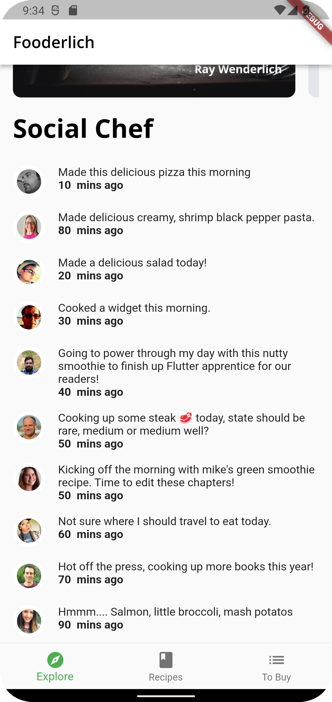

# Fooderlich

### Unleash your spicy imagination!

## Showcase

<table>
  <tr>
    <td>Recipe</td>
    <td>Author</td>
    <td>Explore</td>
  </tr>
  <tr>
    <td></td>
    <td></td>
    <td></td>
  </tr>
 </table>
<br/>

## Stacks

- Dart
- Flutter


## Keypoints
- ListView and GridView support both horizontal and vertical scroll directions.
- The primary property lets Flutter know which scroll view is the primary scroll
view.
- physics in a scroll view lets you change the user scroll interaction.
- Especially in a nested list view, remember to set shrinkWrap to true so you can
give the scroll view a fixed height for all the items in the list.
- Use a FutureBuilder to wait for an asynchronous task to complete.
- we can nest scrollable widgets. For example, we can place a grid view within a
list view.
- Use ScrollController and ScrollNotification to control or listen to scroll
behavior.
- Barrel files are handy to group imports together. They also let you import many
widgets using a single file.


## Widgets
- [AsyncSnapshot](https://api.flutter.dev/flutter/widgets/AsyncSnapshot-class.html)
- [CircularProgressIndicator](https://api.flutter.dev/flutter/material/CircularProgressIndicator-class.html)
- [ClipRRect](https://api.flutter.dev/flutter/widgets/ClipRRect-class.html)
- [FutureBuilder](https://api.flutter.dev/flutter/widgets/FutureBuilder-class.html)
- [GridView](https://api.flutter.dev/flutter/widgets/GridView-class.html)
- [ListView](https://api.flutter.dev/flutter/widgets/ListView-class.html)
- [NeverScrollableScrollPhysics](https://api.flutter.dev/flutter/widgets/NeverScrollableScrollPhysics-class.html)
- [SliverGridDelegateWithFixedCrossAxisCount](https://api.flutter.dev/flutter/rendering/SliverGridDelegate-class.html)
<br/>

## Q&A

```

```

# Docs and References

- [Async-Await in Dart](https://dart.dev/codelabs/async-await)
- [ListView constructors](https://api.flutter.dev/flutter/widgets/ListView-class.html)
- [FutureBuilder docs](https://api.flutter.dev/flutter/widgets/FutureBuilder-class.html)
- [Scroll Physics](https://api.flutter.dev/flutter/widgets/ScrollPhysics-class.html)
- [Blog on GridView](https://medium.com/@greg.perry/decode-gridview-9b123553e604)
- [BoxScrollView implementation](https://git.io/JabcO)
- [Slivers](https://www.raywenderlich.com/19539821-slivers-in-flutter-getting-started)
- [Slivers(Video)](https://www.youtube.com/watch?v=mSc7qFzxHDw)
- [ScrollController](https://api.flutter.dev/flutter/widgets/ScrollController-class.html)
