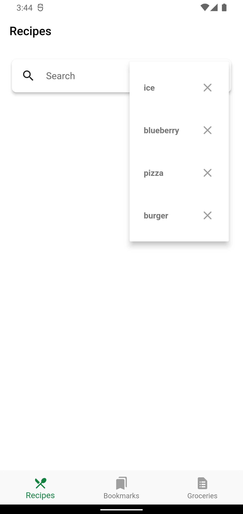

# Fooderlich

### Unleash your spicy imagination!

## Showcase

<table>
  <tr>
    <td>search box</td>
    <td>Search item</td>
    <td>previous searches</td>
  </tr>
  <tr>
    <td></td>
    <td></td>
    <td></td>
  </tr>
 </table>
<br/>

## Stacks

- Dart
- Flutter


## Keypoints

### Chapter 9 - Shared Preference
 - There are multiple ways to save data in an app: to files, in shared preferences and
to a SQLite database.
- Shared preferences are best used to store simple, key-value pairs of primitive types
like strings, numbers and Booleans.
- An example of when to use shared preferences is to save the tab a user is viewing,
so the next time the user starts the app, they’re brought to the same tab.
- The async/await keyword pair let us run asynchronous code off the main UI
thread and then wait for the response. An example is getting an instance of
SharedPreferences.
- The shared_preferences plugin should not be used to hold sensitive data. Instead,
consider using the flutter_secure_storage plugin.


## Q&A

```

```
## Packages
- [shared_preferences](https://pub.dev/packages/shared_preferences)
- [cached_network_image](https://pub.dev/packages/cached_network_image)
- [flutter_slidable](https://pub.dev/packages/flutter_slidable)
- [flutter_svg](https://pub.dev/packages/flutter_svg)

# Docs and References
- [Android SharedPreferences](https://developer.android.com/reference/kotlin/android/content/SharedPreferences?hl=en)
- [iOS  UserDefaults](https://developer.apple.com/documentation/foundation/userdefaults)


