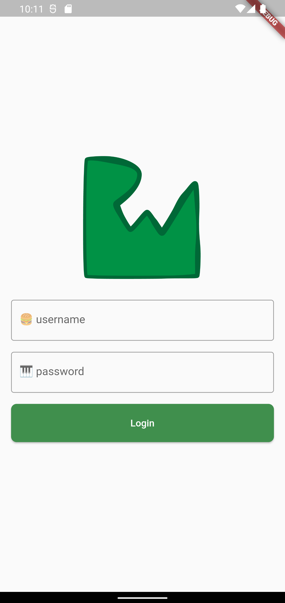

# Fooderlich

### Unleash your spicy imagination!

## Showcase

<table>
  <tr>
    <td>To buy</td>
    <td>Add grocery items</td>
    <td>Grocery list</td>
  </tr>
  <tr>
    <td></td>
    <td></td>
    <td></td>
  </tr>
   <tr>
    <td>Initialize</td>
    <td>Login</td>
    <td>Onboarding</td>
  </tr>
  <tr>
    <td></td>
    <td></td>
    <td></td>
  </tr>
 </table>
<br/>

## Stacks

- Dart
- Flutter


## Keypoints
### Chapter 3
- Three main categories of widgets are: structure and navigation; displaying
information; and, positioning widgets
- Two main visual design systems available in Flutter, Material and
Cupertino
- Using the Material theme, WE can build quite varied user interface elements to
give your app a custom look and feel
- It’s generally a good idea to establish a common theme object for the app, giving
you a single source of truth for app’s style
- The Scaffold widget implements all basic visual layout structure needs
- The Container widget can be used to group other widgets together
- The Container widget can be used to group other widgets together
### Chapter 4
- Flutter maintains three trees in parallel: the Widget, Element and RenderObject
trees.
- A Flutter app only updates the widgets that needs redrawing.
- The Flutter Inspector is a useful tool to debug, experiment with and inspect a
widget tree.
- always start by creating StatelessWidgets, only use
StatefulWidgets state of the widget needs to be managed.
- Inherited widgets are a good solution to access state from the top of the tree.
### Chapter 5 - Scrollable Widgets
- ListView and GridView support both horizontal and vertical scroll directions.
- The primary property lets Flutter know which scroll view is the primary scroll
view.
- physics in a scroll view lets you change the user scroll interaction.
- Especially in a nested list view, remember to set shrinkWrap to true so you can
give the scroll view a fixed height for all the items in the list.
- Use a FutureBuilder to wait for an asynchronous task to complete.
- we can nest scrollable widgets. For example, we can place a grid view within a
list view.
- Use ScrollController and ScrollNotification to control or listen to scroll
behavior.
- Barrel files are handy to group imports together. They also let you import many
widgets using a single file.

### Chapter 6 - Interactive widgets
- We can pass data around with callbacks or provider packages.
- If we need to pass data one level up, we use callbacks.
- If we need to pass data deep in the widget tree, we use providers.
- Provider is a state management helper that acts as a wrapper around inherited
widgets.
- Provider helps expose state model objects to widgets below it.
- Consumer listens for changes to values and rebuilds the widgets below itself.
- Split widgets by screen to keep code modular and organized.
- Create manager objects to manage functions and state changes in one place.
- Gesture widgets recognize and determine the type of touch event. They provide
callbacks to react to events like onTap or onDrag.
- We can use dismissible widgets to swipe away items in a list.

### Chapter 7 - Routes & Navigation
- We can wrap another router in a containing widget.
- Navigator 1.0 is useful for quick and simple prototypes, presenting alerts and
dialogs.
- Navigator 2.0 is useful when we need more control and organization when
managing the navigation stack.
- In Navigator 2.0, the navigator widget holds a list of MaterialPage objects.
- we can use a router widget to listen to navigation state changes and configure our
navigator’s list of pages.
- Setting the router’s Back button dispatcher lets us listen to platform system
events.

### Chapter 8 - Deep Links and Web URLs
- The app notifies RouteInformationProvider when there’s a new route.
- The provider passes the route information to RouteInformationParser to parse
the URL string.
- The parser converts app state to and from a URL string.
- AppLink models the navigation state. It is a user-defined data type that
encapsulates information about a URL string.
- In development mode, the Flutter web app does not persist data between app
launches. The web app generated in release mode will work on the other browsers.


## Widgets & Classes
- [AppBar](https://api.flutter.dev/flutter/material/AppBar-class.html)
- [AssetImage](https://api.flutter.dev/flutter/painting/AssetImage-class.html)
- [BottomNavigationBar](https://api.flutter.dev/flutter/material/BottomNavigationBar-class.html)
- [BottomNavigationBarItem](https://api.flutter.dev/flutter/widgets/BottomNavigationBarItem-class.html)
- [BoxDecoration](https://api.flutter.dev/flutter/painting/BoxDecoration-class.html)
- [Center](https://api.flutter.dev/flutter/widgets/Center-class.html)
- [CircleAvatar](https://api.flutter.dev/flutter/material/CircleAvatar-class.html)
- [Chip](https://api.flutter.dev/flutter/material/Chip-class.html)
- [Column](https://api.flutter.dev/flutter/widgets/Column-class.html)
- [DecorationImage](https://api.flutter.dev/flutter/painting/DecorationImage-class.html)
- [Expanded](https://api.flutter.dev/flutter/widgets/Expanded-class.html)
- [Icon](https://api.flutter.dev/flutter/widgets/Icon-class.html)
- [IconButton](https://api.flutter.dev/flutter/material/IconButton-class.html)
- [Image](https://api.flutter.dev/flutter/widgets/Image-class.html)
- [MaterialApp](https://api.flutter.dev/flutter/material/Material-class.html)
- [Padding](https://api.flutter.dev/flutter/widgets/Padding-class.html)
- [Positioned](https://api.flutter.dev/flutter/widgets/Positioned-class.html)
- [RotatedBox](https://api.flutter.dev/flutter/widgets/RotatedBox-class.html)
- [Row](https://api.flutter.dev/flutter/widgets/Row-class.html)
- [Scaffold](https://api.flutter.dev/flutter/material/Scaffold-class.html)
- [SizedBox](https://api.flutter.dev/flutter/widgets/SizedBox-class.html)
- [SnackBar](https://api.flutter.dev/flutter/material/SnackBar-class.html)
- [Stack](https://api.flutter.dev/flutter/widgets/Stack-class.html)
- [Text](https://api.flutter.dev/flutter/widgets/Text-class.html)
- [TextTheme](https://api.flutter.dev/flutter/material/TextTheme-class.html)
- [ThemeData](https://api.flutter.dev/flutter/material/ThemeData-class.html)
- [Wrap](https://api.flutter.dev/flutter/widgets/Wrap-class.html)

### Chapter 5 - Scrollable Widgets
- [AsyncSnapshot](https://api.flutter.dev/flutter/widgets/AsyncSnapshot-class.html)
- [CircularProgressIndicator](https://api.flutter.dev/flutter/material/CircularProgressIndicator-class.html)
- [ClipRRect](https://api.flutter.dev/flutter/widgets/ClipRRect-class.html)
- [FutureBuilder](https://api.flutter.dev/flutter/widgets/FutureBuilder-class.html)
- [GridView](https://api.flutter.dev/flutter/widgets/GridView-class.html)
- [ListView](https://api.flutter.dev/flutter/widgets/ListView-class.html)
- [NeverScrollableScrollPhysics](https://api.flutter.dev/flutter/widgets/NeverScrollableScrollPhysics-class.html)
- [SliverGridDelegateWithFixedCrossAxisCount](https://api.flutter.dev/flutter/rendering/SliverGridDelegate-class.html)
<br/>

### Chapter 6 - Interactive widgets
- [AlertDialog](https://api.flutter.dev/flutter/material/AlertDialog-class.html)
- [AspectRatio](https://api.flutter.dev/flutter/widgets/AspectRatio-class.html)
- [ChoiceChip](https://api.flutter.dev/flutter/material/ChoiceChip-class.html)
- [DateTime](https://api.flutter.dev/flutter/dart-core/DateTime-class.html)
- [Dismissible](https://api.flutter.dev/flutter/widgets/Dismissible-class.html)
- [Flexible](https://api.flutter.dev/flutter/widgets/Flexible-class.html)
- [IndexedStack](https://api.flutter.dev/flutter/widgets/IndexedStack-class.html)
- [InkWell](https://api.flutter.dev/flutter/material/InkWell-class.html)
- [InputDecoration](https://api.flutter.dev/flutter/material/InputDecoration-class.html)
- [MaterialButton](https://api.flutter.dev/flutter/material/MaterialButton-class.html)
- [ScaffoldMessenger](https://api.flutter.dev/flutter/material/ScaffoldMessenger-class.html)
- [showDialog](https://api.flutter.dev/flutter/material/showDialog.html)
- [showDatePicker](https://api.flutter.dev/flutter/material/showDatePicker.html)
- [showTimePicker](https://api.flutter.dev/flutter/material/showTimePicker.html)
- [Slider](https://api.flutter.dev/flutter/material/Slider-class.html)
- [TextDecoration](https://api.flutter.dev/flutter/dart-ui/TextDecoration-class.html)
- [TextEditingController](https://api.flutter.dev/flutter/widgets/TextEditingController-class.html)
- [TimeOfDay](https://api.flutter.dev/flutter/material/TimeOfDay-class.html)

### Chapter 7 - Routes & Navigation
- [ChangeNotifier](https://api.flutter.dev/flutter/foundation/ChangeNotifier-class.html)
- [Duration](https://api.flutter.dev/flutter/dart-core/Duration-class.html)
- [dispose](https://www.geeksforgeeks.org/flutter-dispose-method-with-example/)
- [RouterDelegate](https://api.flutter.dev/flutter/widgets/RouterDelegate-class.html)
- [GlobalKey](https://api.flutter.dev/flutter/widgets/GlobalKey-class.html)
- [MaterialPage](https://api.flutter.dev/flutter/material/MaterialPage-class.html)
- [NavigatorState](https://api.flutter.dev/flutter/widgets/NavigatorState-class.html)
- [Navigator](https://api.flutter.dev/flutter/widgets/Navigator-class.html)
- [PopNavigatorRouterDelegateMixin](https://api.flutter.dev/flutter/widgets/NavigatorState-class.html)
- [Router](https://api.flutter.dev/flutter/widgets/Router-class.html)
- [RootBackButtonDispatcher](https://api.flutter.dev/flutter/widgets/RootBackButtonDispatcher-class.html)
- [ValueKey](https://api.flutter.dev/flutter/foundation/ValueKey-class.html)

### Chapter 8 - Deep Links and Web URLs
- [RouteInformationParser](https://api.flutter.dev/flutter/widgets/RouteInformationParser-class.html)
- [RouteInformation](https://api.flutter.dev/flutter/widgets/RouteInformation-class.html)

## Q&A

```

```
## Packages
- [flutter_colorpicker](https://pub.dev/packages/flutter_colorpicker)
- [intl](https://pub.dev/packages/intl)
- [provider](https://pub.dev/packages/provider)
- [uuid](https://pub.dev/packages/uuid)
- [smooth_page_indicator]()
- [webview_flutter](https://pub.dev/packages/webview_flutter)

- [url_launcher](https://pub.dev/packages/url_launcher)
- [shared_preferences](https://pub.dev/packages/shared_preferences)

# Docs and References
### Chapter 3 - Basic widgets
- [Material design system](https://material.io)
- [Material UI Components](https://flutter.dev/docs/development/ui/widgets/material)
- [Cupertino UI Components](https://flutter.dev/docs/development/ui/widgets/cupertino)
- [Material Components widgets](https://flutter.dev/docs/development/ui/widgets/material)
- [Layout widgets](https://flutter.dev/docs/development/ui/widgets/layout)
- [Chip widget](https://medium.com/aubergine-solutions/1c46217dca9b)
- [Widget UI component library](https://gallery.flutter.dev/)

### Chapter 4 - Understanding widgets

- [Widget library](https://api.flutter.dev/flutter/widgets/widgets-library.html)
- [Devtools overview](https://flutter.dev/docs/development/tools/devtools/overview)
- [Detailed architectural overview of Flutter and widgets](https://flutter.dev/docs/resources/architectural-overview)
- [Widgets under the hood (Youtube series)](https://www.youtube.com/playlist?list=PLjxrf2q8roU2HdJQDjJzOeO6J3FoFLWr2)
- [Talk on how to render widgets](https://youtu.be/996ZgFRENMs)

### Chapter 5 - Scrollable widgets
- [Async-Await in Dart](https://dart.dev/codelabs/async-await)
- [ListView constructors](https://api.flutter.dev/flutter/widgets/ListView-class.html)
- [FutureBuilder docs](https://api.flutter.dev/flutter/widgets/FutureBuilder-class.html)
- [Scroll Physics](https://api.flutter.dev/flutter/widgets/ScrollPhysics-class.html)
- [Blog on GridView](https://medium.com/@greg.perry/decode-gridview-9b123553e604)
- [BoxScrollView implementation](https://git.io/JabcO)
- [Slivers](https://www.raywenderlich.com/19539821-slivers-in-flutter-getting-started)
- [Slivers(Video)](https://www.youtube.com/watch?v=mSc7qFzxHDw)
- [ScrollController](https://api.flutter.dev/flutter/widgets/ScrollController-class.html)

### Chapter 6 - Scrollable widgets
- [BlockPicker](https://pub.dev/documentation/flutter_colorpicker/latest/flutter_colorpicker/BlockPicker-class.html)
- [Buttons](https://flutter.dev/docs/development/ui/widgets/material#Buttons)
- [ChangeNotifierProvider](https://pub.dev/documentation/provider/latest/provider/ChangeNotifierProvider-class.html)
- [Chip types](https://material.io/components/chips/flutter#types)
- [DateFormat](https://api.flutter.dev/flutter/intl/DateFormat-class.html)
- [Enum](https://www.educative.io/blog/dart-2-language-features)
- [Gestures](https://flutter.dev/docs/development/ui/advanced/gestures)
- [How wrap works!(Video)](https://youtu.be/z5iw2SeFx2M)
- [MultiProvider](https://pub.dev/documentation/provider/latest/provider/MultiProvider-class.html)
- [Text fields](https://flutter.dev/docs/cookbook/forms/text-field-changes)

### Chapter 7 - Routes & Navigation
- [Flutter’s Dev Cookbook Tutorials](https://flutter.dev/docs/cookbook/navigation)
- [Flutter Navigation: Getting Started by Filip Babić](https://www.raywenderlich.com/4562634-flutter-navigation-getting-started)
- [Motivation behind Navigator 2.0 - the design document](https://bit.ly/3BcjjMU)
- [Navigator 2.0 presentation by Chun-Heng Tai](https://youtu.be/xFFQKvcad3s?t=3158)
- [Walks through into a Navigator 2.0 example](https://www.youtube.com/watch?v=Y6kh5UonEZ0)
- [The differences between Navigator 1.0 and 2.0](https://youtu.be/JmfYeF4gUu0?t=9728)

### Chapter 8 - Deep Links and Web URLs
- [iOS Universal Links](https://www.raywenderlich.com/6080-universal-links-make-the-connection)
- [Android App Links](https://www.raywenderlich.com/18330247-deep-links-in-android-getting-started)
- [How to build and release an app](https://flutter.dev/docs/deployment/web#building-the-app-for-release)
- [Url strategies eg- how to remove the trailing '#'](https://flutter.dev/docs/development/ui/navigation/url-strategies)
- [Flutter folio - an example project](https://github.com/gskinnerTeam/flutter-folio)
- [examples of two different types of web renderers here](https://flutter.dev/docs/development/tools/web-renderers)


### Other Navigator 2.0 packages
- https://pub.dev/packages/auto_route
- https://pub.dev/packages/fluro
- https://pub.dev/packages/beamer

