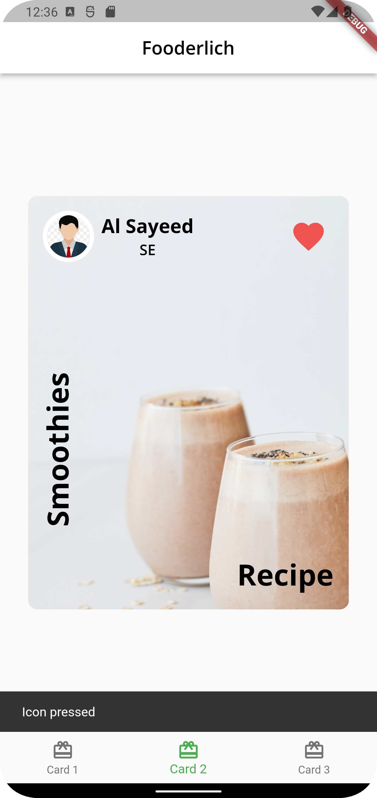

# Fooderlich

### Unleash your spicy imagination!

## Showcase

<table>
  <tr>
    <td>Recipe</td>
    <td>Author</td>
    <td>Explore</td>
  </tr>
  <tr>
    <td></td>
    <td></td>
    <td></td>
  </tr>
 </table>
 

## Stacks

- Dart
- Flutter

 

## Widgets

- [AppBar](https://api.flutter.dev/flutter/material/AppBar-class.html)
- [AssetImage]()
- [BottomNavigationBar]()
- [BottomNavigationBarItem]()
- [BoxDecoration]()
- [Center]()
- [CircleAvatar]()
- [Chip]()
- [Column]()
- [DecorationImage]()
- [Expanded](https://api.flutter.dev/flutter/widgets/Expanded-class.html)
- [Icon]()
- [IconButton]()
- [Image](https://api.flutter.dev/flutter/widgets/Image-class.html)
- [MaterialApp](https://api.flutter.dev/flutter/material/Material-class.html)
- [Padding](https://api.flutter.dev/flutter/widgets/Padding-class.html)
- [Positioned]()
- [RotatedBox]()
- [Row]()
- [Scaffold](https://api.flutter.dev/flutter/material/Scaffold-class.html)
- [SizedBox]()
- [SnackBar]()
- [Stack]()
- [Text](https://api.flutter.dev/flutter/widgets/Text-class.html)
- [TextTheme]()
- [ThemeData]()
- [Wrap]()
 

## Docs and References
- [Flutter docs](https://api.flutter.dev/)
- [Material library](https://api.flutter.dev/flutter/material/material-library.html)
- [Widgets library](https://api.flutter.dev/flutter/widgets/widgets-library.html)